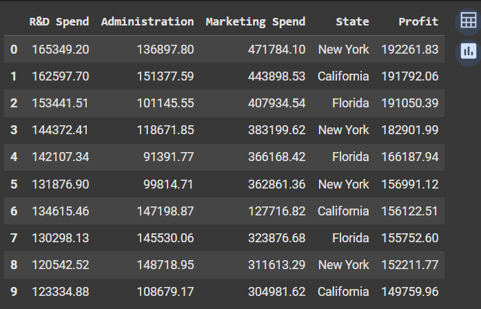
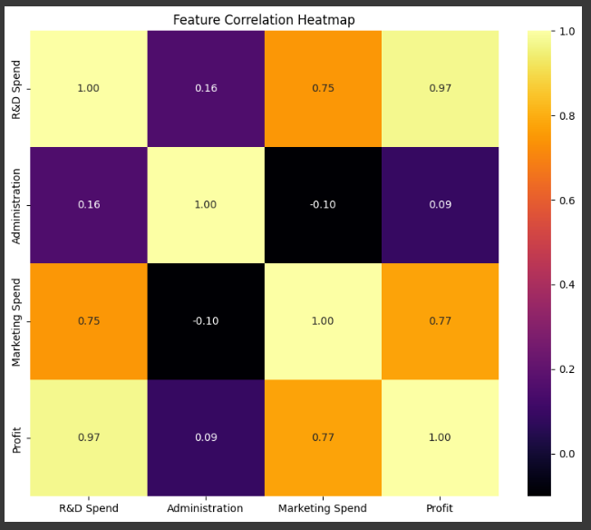
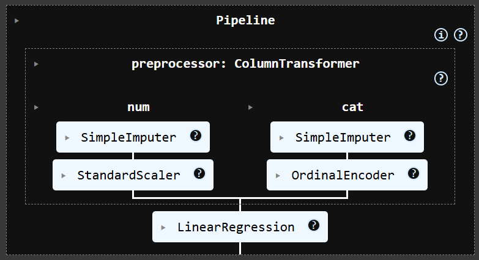
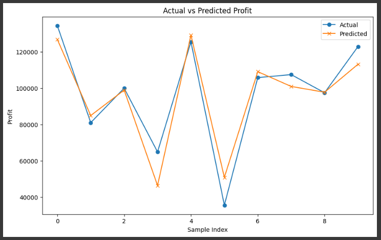

# 50 Startups - Learning ML Pipelines

## Overview
This project was created as part of my learning journey in **Machine Learning pipelines**.  
I applied a **Linear Regression** model to predict startup profits based on R&D Spend, Administration, Marketing Spend, and State.

---

## What I Learned
- How to build and structure a **preprocessing pipeline** using **scikit-learn**.
- Handling **numeric** features with imputation and scaling.
- Handling **categorical** features using:
  - **OneHotEncoder**
  - **OrdinalEncoder**
- Observed that using **OrdinalEncoder improved the model accuracy by ~1%** compared to OneHotEncoder.

---

## Dataset
The dataset `50_Startups.csv` contains 50 records of startup data with:
- **R&D Spend**
- **Administration**
- **Marketing Spend**
- **State** (categorical)
- **Profit** (target)

### Sample of the Data


### Correlation Heatmap


---

## Project Structure
```
50_Startups_Liner_regration/
│
├── data/
│   └── 50_Startups.csv
│
├── notebooks/
│   └── 50_Startups_pipline.ipynb
│
├── src/
│   └── pipeline.py
│
├── images/
│   ├── data_head.png
│   ├── correlation_heatmap.png
│   ├── pipeline_structure.png
│   └── results_plot.png
│
├── model_pipeline.pkl
├── requirements.txt
├── README.md
└── .gitignore
```

---

## Results
Example output:
```
Mean Squared Error: 80929465.49
R-squared: 0.9000
Mean Absolute Error: 6979.17
```

Using **OrdinalEncoder** gave a ~1% improvement in model accuracy compared to OneHotEncoder.

### Pipeline Structure


### Model Results


---

## Saving and Loading the Pipeline
After training, the pipeline was saved for future use:
```python
import joblib
joblib.dump(pipeline, "model_pipeline.pkl")
```

To load and use it later:
```python
import joblib
loaded_pipeline = joblib.load("model_pipeline.pkl")
predictions = loaded_pipeline.predict(x_test)
```

---

## Notes
This project was created to **practice ML pipelines** and understand how different categorical encoders affect model performance.
